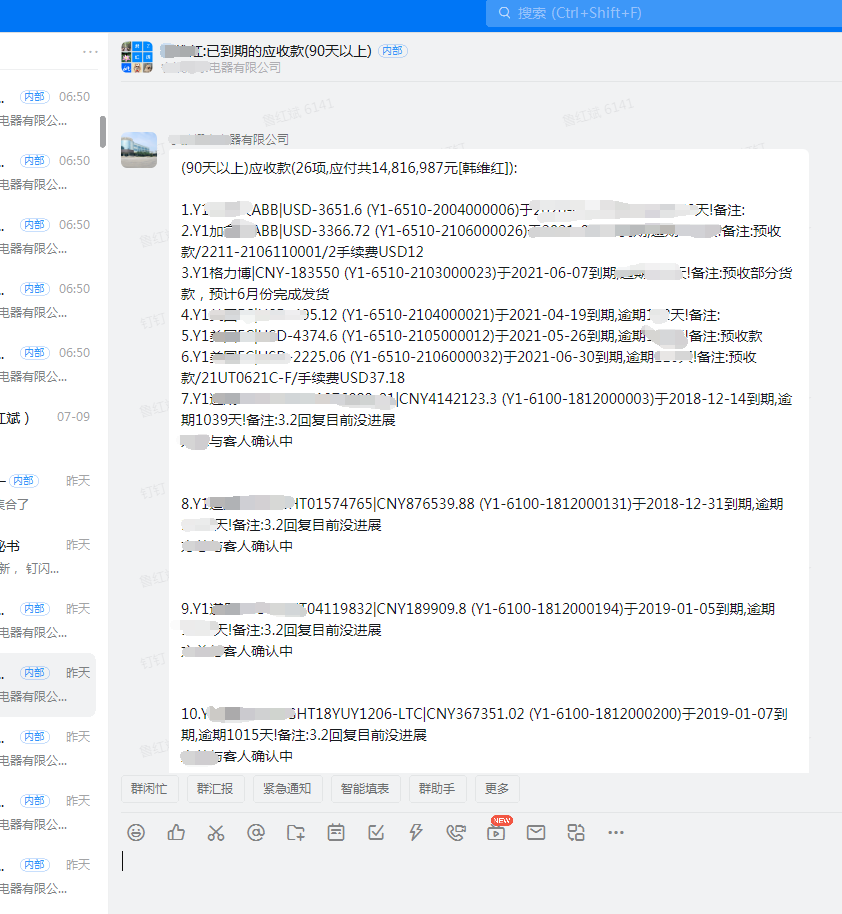
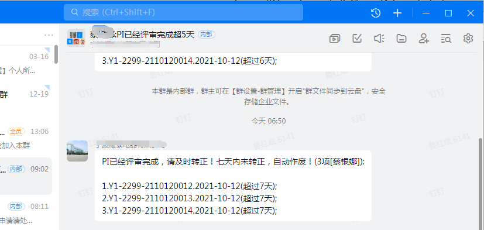
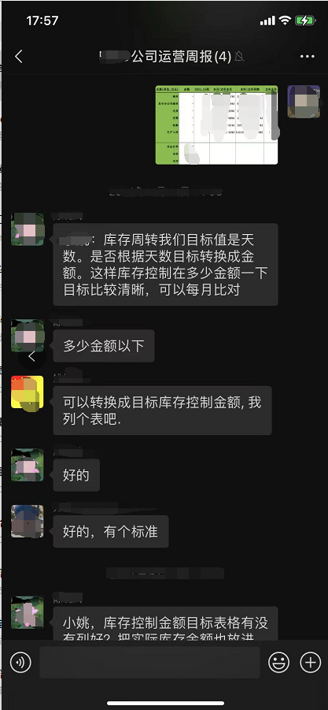
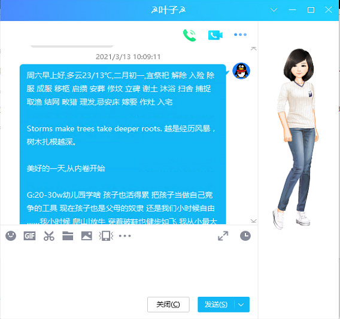

# sendweixin

sendweixin 涉及:

通讯接口:微信/QQ/钉钉/有度 定时发送消息

数据库:T100的oracle,用户开发用的SQLSERVER/MySQL,odoo的PostGreSQL

第三方API:微信问候的词霸每日一句(http://open.iciba.com/dsapi/),天气信息（http://www.weather.com.cn/weather/%s.shtml），黄历（https://wannianrili.51240.com/），图灵机器人的自动回答（"http://www.tuling123.com/openapi/api）

>注意：本代码包含了 由定时发送模块 为招投标系统(https://github.com/luhongbin/bidding)提供钉钉用户信息 到招投标系统的更新用户表，离职用户会被自动删除 新增用户被添加 

## 项目实例(所有功能 都是企业实际运行多年的代码)

### 钉钉提醒实例

* 钉钉实例

> 注意：源码中涉及的管理思想具有很强的实用价值，是T100 odoo等用户很好的助手

* 微信实例

> 注意：这些自动生成的消息 定时发送给指定人员

* QQ实例

> 注意：QQ没有提供API 所以通过 模仿键盘鼠标操作 完成信息发送

> 注意：我司最早采用rtx发送消息，后续会开源...然后是有度 企业微信 到钉钉...目前采用钉钉作为IM沟通 因此只能无法给出有度的截屏效果 但是代码都是可用的

### 主控代码实例

* SENDWEIXIN.py模块实例

> 1. 主控模块 程序入口
> 2. 完成定时任务调度设置
> 3. 图灵API放置处，可以让微信给你讲个笑话 故事等等
> 4. 节假日的定时消息发送 比如春节的微信拜年。。。年年如此 每个人都会挖出来拜年 拜年语自己设置
> 5. QQ消息 还有微信消息 都是这个模块控制的

> 注意：初次进入时 要扫描微信二维码。。。代码一些延时参数不要缩短 会导致信息漏发

### 实用模块实例

* utility.py模块实例

> 1. 从T100数据库中获取询价单数据 QQ邮箱通知各个供应商管理系统报价(该系统是DJANGO写的,已淘汰,被新系统取代(https://github.com/luhongbin/bidding))
> 2. 爬取ODOO系统的销售数据 结果发送给有关人员 当时这个内部通知采用RTX,因此数据保存到RTX需要的数据库中 定时发送
> 3. 取T100的数据 保存到DJANGO平台的数据库中 保证两个系统的数据统一
> 4. QQ自动发送子程序 读取词霸\黄历\天气子程序
> 5. excel截屏子程序 用于发送微信公司周报

> 注意：RTX发送子程序 由vfp代码完成(https://github.com/luhongbin/remotion)

### 有度模块实例

* youduim.py模块实例

> 1. 有度发送文字图片视频等消息模块,由于改为钉钉发送 ,原模块已经注释 可用
> 2. 获取钉钉用户消息 更新到SQLSERVER 用于发送用户消息 创建群消息
> 3. T100:复检申请请处理/检验不合格验退请处理/供应商据点信息缺失/客户据点信息缺失/采购员离职，提醒数据维护/#供应商据点付款条件缺失，提醒数据维护/厂内工单的工单工艺是委外工单的请变更/PI已经评审完成，请及时转正/订单请及时审核/待处理品库库存/收货单已检验完成请及时入库/自制待处理品库库存请及时处理/周计划更改采购交期/检验单已生成请及时检验/对于未结预付款进行有度触发跟踪/将到期和已到期的应收款

> 注意：钉钉发送消息参数 请自行配置

## 项目代码

* [GitHub](https://github.com/luhongbin/sendweixin)

## 技术栈

> 1. python
> 2. dingtalk
> 3. wxpy
> 4. entapp
> 5. scheduler

## 开发计划

目前项目开发中，只是满足企业自身需要，可以以此框架 延伸自己的应用

## 警告

> 1. 本项目成熟稳定 多年运营正常
> 2. 本项目你可以任意发布，但是我方不承担 任何使用后果
> 3. 本项目代码开源[MIT](./LICENSE)，项目文档采用 [署名-禁止演绎 4.0 国际协议许可](https://creativecommons.org/licenses/by-nd/4.0/deed.zh)

## 问题

 * 开发者有问题或者好的建议可以用Issues反馈交流，请给出详细信息
 * 在开发交流群中应讨论开发、业务和合作问题
 * 如果真的需要QQ群里提问，请在提问前先完成以下过程：
    * 请阅读[提问的智慧](https://github.com/ryanhanwu/How-To-Ask-Questions-The-Smart-Way/blob/master/README-zh_CN.md)；
    * 请百度或谷歌相关技术；
    * 请查看相关技术的官方文档，例如微信小程序的官方文档；
    * 请提问前尽可能做一些DEBUG或者思考分析，然后提问时给出详细的错误相关信息以及个人对问题的理解。

## License

[MIT](https://github.com/luhongbin/sendweixin/blob/master/LICENSE)
Copyright (c) 2021-present luhongbin